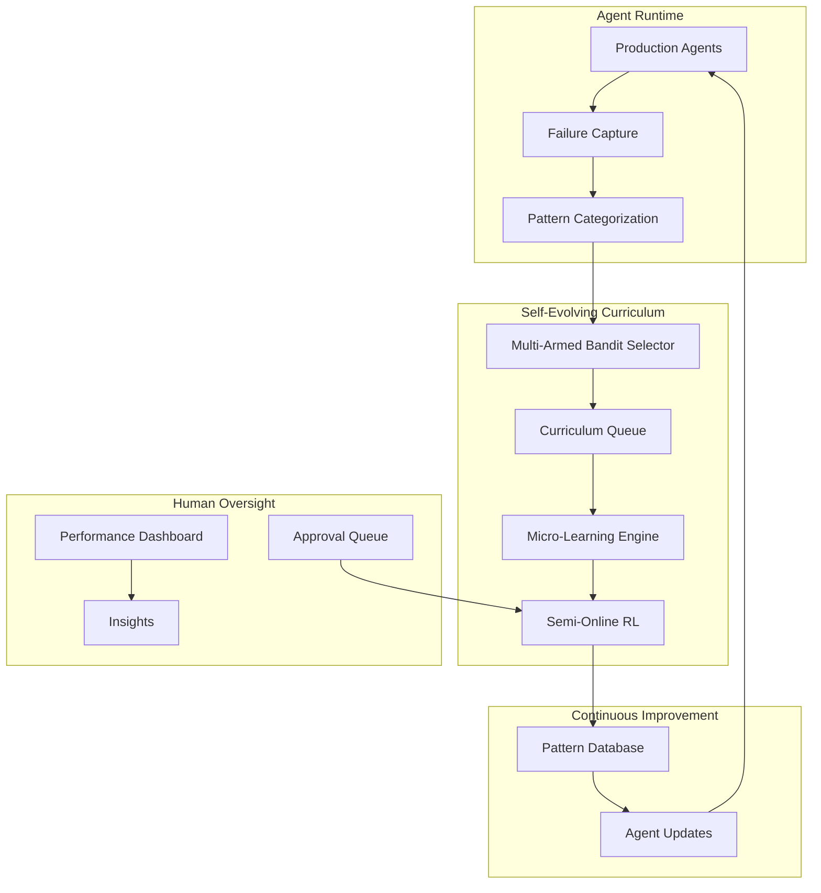

# Arc Self-Evolving Curriculum: Proof of Concept Implementation

## Executive Summary

Arc implements Stanford's Self-Evolving Curriculum (SEC) research for production AI agents. Instead of static training, Arc creates an adaptive learning system where agents automatically learn from their failures using a Multi-Armed Bandit approach to optimize their own curriculum.

**Core Innovation**: Transform production failures into a self-optimizing curriculum that continuously improves agent performance without human intervention.

## Architecture Overview



## Phase 1: Minimal SEC Implementation (Week 1)

### 1.1 Core Components

#### Failure Pattern Categorizer
```python
# arc/curriculum/categorizer.py
from typing import Dict, Any, Optional
from dataclasses import dataclass
import hashlib
import json

@dataclass
class FailurePattern:
    pattern_id: str
    category: str
    signature: Dict[str, Any]
    first_seen: float
    occurrences: int = 1
    
class FailureCategorizer:
    """
    Categorizes agent failures into learnable patterns
    """
    def __init__(self):
        self.patterns: Dict[str, FailurePattern] = {}
        self.pattern_signatures = {
            'api_schema': self._check_api_schema_error,
            'auth_failure': self._check_auth_error,
            'parsing_error': self._check_parsing_error,
            'timeout': self._check_timeout_error,
            'validation': self._check_validation_error,
            'unknown': lambda x: True  # Catch-all
        }
    
    def categorize(self, failure_context: Dict[str, Any]) -> FailurePattern:
        """
        Categorize a failure into a pattern for curriculum learning
        """
        # Extract failure signature
        signature = self._extract_signature(failure_context)
        pattern_id = self._generate_pattern_id(signature)
        
        # Check if we've seen this pattern before
        if pattern_id in self.patterns:
            self.patterns[pattern_id].occurrences += 1
            return self.patterns[pattern_id]
        
        # Determine category
        category = self._determine_category(failure_context)
        
        # Create new pattern
        pattern = FailurePattern(
            pattern_id=pattern_id,
            category=category,
            signature=signature,
            first_seen=time.time()
        )
        
        self.patterns[pattern_id] = pattern
        return pattern
    
    def _extract_signature(self, failure_context: Dict[str, Any]) -> Dict[str, Any]:
        """Extract key features that define this failure pattern"""
        return {
            'error_type': failure_context.get('error_type'),
            'error_message': self._normalize_error_message(
                failure_context.get('error_message', '')
            ),
            'task_type': failure_context.get('task_type'),
            'input_schema': self._extract_schema(failure_context.get('input')),
            'output_schema': self._extract_schema(failure_context.get('output'))
        }
    
    def _generate_pattern_id(self, signature: Dict[str, Any]) -> str:
        """Generate unique ID for this failure pattern"""
        sig_str = json.dumps(signature, sort_keys=True)
        return hashlib.md5(sig_str.encode()).hexdigest()[:12]
```

#### Multi-Armed Bandit Selector
```python
# arc/curriculum/bandit.py
import math
from typing import List, Tuple, Dict
from collections import defaultdict
import numpy as np
import torch

class MultiArmedBanditSelector:
    """
    Implements SEC's TD(0) Multi-Armed Bandit for curriculum learning
    Based on Stanford's SEC paper and VERL's GRPO advantage calculation
    """
    def __init__(self, 
                 learning_rate: float = 0.1,  # α in TD(0) update
                 temperature: float = 1.0):   # τ for softmax sampling
        self.learning_rate = learning_rate
        self.temperature = temperature
        self.Q_values = defaultdict(float)  # Qt(c) in SEC algorithm
        self.arm_counts = defaultdict(int)
        self.total_steps = 0
        
    def select_patterns(self, 
                       available_patterns: List[FailurePattern], 
                       batch_size: int = 10) -> List[Tuple[float, FailurePattern]]:
        """
        Select patterns using softmax sampling over Q-values (SEC Algorithm 1, line 5)
        """
        pattern_scores = []
        
        # Calculate softmax probabilities over Q-values
        q_values = [self.Q_values[pattern.pattern_id] for pattern in available_patterns]
        if not q_values:
            return []
            
        # Softmax sampling with temperature
        q_tensor = torch.tensor(q_values, dtype=torch.float32)
        probabilities = torch.softmax(q_tensor / self.temperature, dim=0)
        
        # Sample according to probabilities
        selected_indices = torch.multinomial(probabilities, 
                                           min(batch_size, len(available_patterns)), 
                                           replacement=True)
        
        for idx in selected_indices:
            pattern = available_patterns[idx]
            q_value = self.Q_values[pattern.pattern_id]
            pattern_scores.append((q_value, pattern))
        
        return pattern_scores
    
    def update_rewards(self, pattern_rewards: Dict[str, float]):
        """
        Update Q-values using TD(0) method (SEC Algorithm 1, line 14)
        Qt+1(c) = α * rt(c) + (1 - α) * Qt(c)
        """
        for pattern_id, reward in pattern_rewards.items():
            # TD(0) update from SEC paper
            self.Q_values[pattern_id] = (
                self.learning_rate * reward + 
                (1 - self.learning_rate) * self.Q_values[pattern_id]
            )
            self.arm_counts[pattern_id] += 1
        
        self.total_steps += 1
    
    def calculate_absolute_advantage_reward(self, 
                                          pattern_id: str,
                                          advantages: torch.Tensor) -> float:
        """
        Calculate reward as absolute advantage (SEC Equation 3)
        r(c) = E[|Â|] for patterns in category c
        """
        if len(advantages) == 0:
            return 0.0
            
        # SEC uses absolute advantage as reward signal
        absolute_advantages = torch.abs(advantages)
        reward = torch.mean(absolute_advantages).item()
        
        return reward
    
    def get_curriculum_stats(self) -> Dict[str, Any]:
        """
        Get statistics for dashboard display
        """
        return {
            'total_steps': self.total_steps,
            'active_patterns': len(self.Q_values),
            'q_values': dict(self.Q_values),
            'arm_counts': dict(self.arm_counts),
            'temperature': self.temperature
        }
```

#### Micro-Learning Engine
```python
# arc/curriculum/micro_learning.py
from typing import List, Dict, Any, Optional
import asyncio
from dataclasses import dataclass

@dataclass
class LearningResult:
    pattern_id: str
    improvement: float
    confidence: float
    fix_strategy: Dict[str, Any]
    examples_learned: int

class MicroLearningEngine:
    """
    Implements fast, incremental learning from failure patterns
    """
    def __init__(self, base_model: str = "gpt-4"):
        self.base_model = base_model
        self.pattern_knowledge = {}
        
    async def learn_from_patterns(self, 
                                  patterns: List[FailurePattern],
                                  failure_examples: Dict[str, List[Dict]]) -> List[LearningResult]:
        """
        Perform micro-learning on selected patterns
        """
        results = []
        
        for pattern in patterns:
            examples = failure_examples.get(pattern.pattern_id, [])
            if not examples:
                continue
                
            result = await self._learn_pattern(pattern, examples)
            results.append(result)
            
            # Store learned knowledge
            self.pattern_knowledge[pattern.pattern_id] = result.fix_strategy
            
        return results
    
    async def _learn_pattern(self, 
                            pattern: FailurePattern, 
                            examples: List[Dict]) -> LearningResult:
        """
        Learn how to fix a specific failure pattern
        """
        # Analyze failure examples
        analysis = await self._analyze_failures(examples)
        
        # Generate fix strategy
        fix_strategy = await self._generate_fix_strategy(pattern, analysis)
        
        # Validate fix on subset of examples
        validation_results = await self._validate_fix(fix_strategy, examples[:5])
        
        improvement = validation_results['success_rate']
        confidence = validation_results['confidence']
        
        return LearningResult(
            pattern_id=pattern.pattern_id,
            improvement=improvement,
            confidence=confidence,
            fix_strategy=fix_strategy,
            examples_learned=len(examples)
        )
    
    async def _analyze_failures(self, examples: List[Dict]) -> Dict[str, Any]:
        """Analyze common patterns in failures"""
        # Implementation: Use LLM to analyze failure patterns
        prompt = self._build_analysis_prompt(examples)
        # ... LLM call implementation
        return {
            'common_issues': [],
            'root_cause': "",
            'suggested_fixes': []
        }
    
    async def _generate_fix_strategy(self, 
                                    pattern: FailurePattern, 
                                    analysis: Dict) -> Dict[str, Any]:
        """Generate a strategy to fix this failure pattern"""
        return {
            'pattern_id': pattern.pattern_id,
            'fix_type': 'prompt_adjustment',  # or 'few_shot', 'fine_tune', etc.
            'fix_content': {
                'prompt_additions': [],
                'validation_rules': [],
                'examples': []
            }
        }
```

### 1.2 Agent Integration

#### Simple Agent Wrapper
```python
# arc/agent/wrapper.py
import functools
import asyncio
from typing import Any, Callable, Optional

class ArcAgent:
    """
    Wrapper that adds self-improvement capabilities to any agent
    """
    def __init__(self, agent_id: str):
        self.agent_id = agent_id
        self.arc_client = ArcClient()
        self.pattern_fixes = {}
        
    def track_failures(self, func: Callable) -> Callable:
        """
        Decorator to add failure tracking and self-improvement
        """
        @functools.wraps(func)
        async def wrapper(*args, **kwargs):
            try:
                # Check for known patterns before execution
                preemptive_fix = await self._check_known_patterns(args, kwargs)
                if preemptive_fix:
                    kwargs.update(preemptive_fix)
                
                # Execute the function
                result = await func(*args, **kwargs)
                
                # Report success for pattern reinforcement
                await self._report_success(args, kwargs, result)
                
                return result
                
            except Exception as e:
                # Capture failure context
                failure_context = {
                    'agent_id': self.agent_id,
                    'function': func.__name__,
                    'args': args,
                    'kwargs': kwargs,
                    'error': str(e),
                    'error_type': type(e).__name__,
                    'timestamp': time.time()
                }
                
                # Report to Arc for learning
                improvement = await self.arc_client.report_failure(failure_context)
                
                # If we got an immediate fix, retry
                if improvement and improvement.confidence > 0.8:
                    return await self._retry_with_fix(
                        func, args, kwargs, improvement
                    )
                
                # Otherwise, propagate the error
                raise
                
        return wrapper
    
    async def _retry_with_fix(self, func, args, kwargs, improvement):
        """Apply learned fix and retry"""
        # Apply the fix strategy
        fixed_kwargs = self._apply_fix(kwargs, improvement.fix_strategy)
        
        # Retry with fix
        return await func(*args, **fixed_kwargs)
```

### 1.3 Dashboard & Visualization

#### Real-Time Dashboard
```python
# arc/dashboard/live_view.py
from typing import Dict, List
import asyncio
from datetime import datetime, timedelta

class ArcLiveDashboard:
    """
    Real-time view of autonomous learning progress
    """
    def __init__(self):
        self.metrics = {
            'total_failures': 0,
            'patterns_identified': 0,
            'patterns_learning': 0,
            'improvements_deployed': 0,
            'current_success_rate': 0.0,
            'baseline_success_rate': 0.0
        }
        self.active_curriculum = []
        self.recent_improvements = []
        
    async def get_dashboard_state(self) -> Dict[str, Any]:
        """
        Get current state for dashboard display
        """
        return {
            'curriculum_status': {
                'next_sync': self._get_next_sync_time(),
                'learning_health': self._calculate_health_score(),
                'active_patterns': len(self.active_curriculum)
            },
            'metrics': {
                'failures_last_hour': self._get_recent_failures(),
                'patterns_learned': self.metrics['patterns_identified'],
                'success_improvement': (
                    self.metrics['current_success_rate'] - 
                    self.metrics['baseline_success_rate']
                ),
                'agent_downtime_saved': self._calculate_downtime_saved()
            },
            'active_learning': [
                {
                    'pattern': pattern.category,
                    'occurrences': pattern.occurrences,
                    'ucb_score': score,
                    'status': 'learning'
                }
                for score, pattern in self.active_curriculum[:5]
            ],
            'recent_improvements': self.recent_improvements[-10:]
        }
    
    def _calculate_health_score(self) -> str:
        """Calculate overall system health"""
        improvement_rate = (
            self.metrics['improvements_deployed'] / 
            max(self.metrics['patterns_identified'], 1)
        )
        
        if improvement_rate > 0.8:
            return "excellent"
        elif improvement_rate > 0.6:
            return "good"
        elif improvement_rate > 0.4:
            return "fair"
        else:
            return "needs_attention"
```

## Phase 2: Full Learning Loop (Week 2)

### 2.1 Semi-Online RL Integration

#### VERL Integration with SEC Advantage Calculation
```python
# arc/training/semi_online.py
from verl.trainer.ppo import PPOTrainer
from verl.trainer.ppo.core_algos import compute_grpo_outcome_advantage
from typing import List, Dict, Optional
import torch
import numpy as np

class ArcSemiOnlineTrainer:
    """
    Implements semi-online RL with SEC curriculum and VERL's GRPO
    Based on Meta's s=50 research and Stanford's SEC paper
    """
    def __init__(self, 
                 base_model: str,
                 sync_interval: int = 50,
                 use_sec_curriculum: bool = True):
        self.sync_interval = sync_interval
        self.use_sec_curriculum = use_sec_curriculum
        
        # Initialize VERL trainer with GRPO for absolute advantage
        self.trainer = PPOTrainer(
            model_path=base_model,
            config={
                'learning_rate': 1e-6,
                'batch_size': 32,
                'gradient_accumulation_steps': 4,
                'use_lora': True,
                'lora_rank': 16,
                'algorithm': 'grpo',  # Use GRPO for advantage calculation
                'norm_adv_by_std_in_grpo': True
            }
        )
        
        self.training_buffer = []
        self.pattern_to_index = {}  # Map patterns to group indices for GRPO
        self.steps_since_sync = 0
        
    async def add_training_examples(self, 
                                   pattern: FailurePattern,
                                   examples: List[Dict],
                                   fix_strategy: Dict):
        """
        Add examples to training buffer with pattern indexing
        """
        # Assign group index for this pattern (required by GRPO)
        if pattern.pattern_id not in self.pattern_to_index:
            self.pattern_to_index[pattern.pattern_id] = len(self.pattern_to_index)
        
        pattern_index = self.pattern_to_index[pattern.pattern_id]
        
        for example in examples:
            training_pair = self._create_training_pair(
                example, fix_strategy, pattern_index
            )
            self.training_buffer.append(training_pair)
        
        # Check if we should sync
        self.steps_since_sync += len(examples)
        if self.steps_since_sync >= self.sync_interval:
            await self.sync_and_train()
    
    async def sync_and_train(self):
        """
        Perform semi-online training update with SEC curriculum feedback
        """
        if not self.training_buffer:
            return
            
        # Prepare data for VERL training
        batches = self._create_batches_with_indices(self.training_buffer)
        
        # Train with VERL and get advantages for curriculum update
        training_results = await self.trainer.train_epoch_with_advantages(batches)
        
        # Calculate SEC curriculum rewards from absolute advantages
        if self.use_sec_curriculum:
            pattern_rewards = self._calculate_sec_rewards(
                training_results['advantages'],
                training_results['pattern_indices']
            )
            return {
                'training_metrics': training_results['metrics'],
                'curriculum_rewards': pattern_rewards
            }
        
        # Clear buffer and reset counter
        self.training_buffer = []
        self.steps_since_sync = 0
        
        return training_results
    
    def _calculate_sec_rewards(self, 
                              advantages: torch.Tensor,
                              pattern_indices: np.ndarray) -> Dict[str, float]:
        """
        Calculate SEC curriculum rewards using VERL's GRPO advantages
        Implements SEC Equation 3: r(c) = E[|Â|] for category c
        """
        pattern_rewards = {}
        
        # Group advantages by pattern (like GRPO groups by index)
        for pattern_id, group_index in self.pattern_to_index.items():
            # Find advantages for this pattern
            mask = pattern_indices == group_index
            if mask.sum() == 0:
                continue
                
            pattern_advantages = advantages[mask]
            
            # Calculate absolute advantage reward (SEC paper)
            absolute_advantage_reward = torch.mean(torch.abs(pattern_advantages)).item()
            pattern_rewards[pattern_id] = absolute_advantage_reward
        
        return pattern_rewards
    
    def _create_training_pair(self, 
                             example: Dict, 
                             fix_strategy: Dict,
                             pattern_index: int) -> Dict:
        """
        Create training pair with pattern index for GRPO grouping
        """
        return {
            'input': example['input'],
            'output': example['output'],
            'expected': example.get('expected_output'),
            'fix_strategy': fix_strategy,
            'pattern_index': pattern_index,  # For GRPO advantage calculation
            'metadata': example.get('metadata', {})
        }
    
    def _create_batches_with_indices(self, training_data: List[Dict]) -> List[Dict]:
        """
        Create batches with pattern indices for GRPO advantage calculation
        """
        # Group by pattern for efficient GRPO computation
        pattern_groups = {}
        for item in training_data:
            pattern_idx = item['pattern_index']
            if pattern_idx not in pattern_groups:
                pattern_groups[pattern_idx] = []
            pattern_groups[pattern_idx].append(item)
        
        # Create balanced batches maintaining pattern groups
        batches = []
        current_batch = []
        
        for pattern_idx, items in pattern_groups.items():
            for item in items:
                current_batch.append(item)
                if len(current_batch) >= 32:  # batch_size
                    batches.append({
                        'data': current_batch,
                        'indices': [item['pattern_index'] for item in current_batch]
                    })
                    current_batch = []
        
        # Add remaining items
        if current_batch:
            batches.append({
                'data': current_batch,
                'indices': [item['pattern_index'] for item in current_batch]
            })
        
        return batches
```

### 2.2 Pattern Knowledge Base

#### Distributed Pattern Storage
```python
# arc/knowledge/pattern_db.py
import redis
import json
from typing import Optional, List, Dict
import numpy as np
from sentence_transformers import SentenceTransformer

class PatternKnowledgeBase:
    """
    Distributed storage for learned failure patterns
    """
    def __init__(self, redis_url: str):
        self.redis = redis.from_url(redis_url)
        self.encoder = SentenceTransformer('all-MiniLM-L6-v2')
        
    async def store_pattern_fix(self, 
                               pattern_id: str,
                               fix_strategy: Dict[str, Any],
                               success_rate: float):
        """
        Store a learned fix for a pattern
        """
        # Encode pattern for similarity search
        pattern_embedding = self._encode_pattern(fix_strategy)
        
        # Store in Redis with metadata
        key = f"pattern:{pattern_id}"
        value = {
            'fix_strategy': fix_strategy,
            'success_rate': success_rate,
            'last_updated': time.time(),
            'times_used': 0
        }
        
        self.redis.hset(key, mapping={
            'data': json.dumps(value),
            'embedding': pattern_embedding.tobytes()
        })
        
    async def find_similar_patterns(self, 
                                   failure_context: Dict,
                                   threshold: float = 0.85) -> List[Dict]:
        """
        Find similar patterns using vector similarity
        """
        query_embedding = self._encode_context(failure_context)
        
        # Get all patterns (in production, use vector DB)
        pattern_keys = self.redis.keys("pattern:*")
        similar_patterns = []
        
        for key in pattern_keys:
            data = self.redis.hget(key, 'embedding')
            if not data:
                continue
                
            pattern_embedding = np.frombuffer(data, dtype=np.float32)
            similarity = self._cosine_similarity(
                query_embedding, pattern_embedding
            )
            
            if similarity > threshold:
                pattern_data = json.loads(
                    self.redis.hget(key, 'data')
                )
                pattern_data['similarity'] = similarity
                similar_patterns.append(pattern_data)
        
        return sorted(
            similar_patterns, 
            key=lambda x: x['similarity'], 
            reverse=True
        )
```

### 2.3 Human Approval System

#### Approval Queue Manager
```python
# arc/approval/manager.py
from enum import Enum
from typing import List, Dict, Optional
import asyncio

class ApprovalStatus(Enum):
    PENDING = "pending"
    APPROVED = "approved"
    DENIED = "denied"
    AUTO_APPROVED = "auto_approved"

class ApprovalRequest:
    def __init__(self, 
                 pattern_id: str,
                 fix_strategy: Dict,
                 impact_assessment: Dict):
        self.id = str(uuid.uuid4())
        self.pattern_id = pattern_id
        self.fix_strategy = fix_strategy
        self.impact = impact_assessment
        self.status = ApprovalStatus.PENDING
        self.created_at = time.time()
        
class HumanApprovalManager:
    """
    Manages human oversight for significant changes
    """
    def __init__(self):
        self.approval_queue: List[ApprovalRequest] = []
        self.auto_approve_threshold = {
            'confidence': 0.95,
            'impact': 'low',
            'success_rate': 0.9
        }
        
    async def request_approval(self, 
                              pattern: FailurePattern,
                              fix_strategy: Dict,
                              learning_result: LearningResult) -> ApprovalRequest:
        """
        Create approval request for significant changes
        """
        impact = self._assess_impact(pattern, fix_strategy)
        
        # Check if we can auto-approve
        if self._can_auto_approve(learning_result, impact):
            return self._create_auto_approval(
                pattern, fix_strategy, impact
            )
        
        # Create manual approval request
        request = ApprovalRequest(
            pattern_id=pattern.pattern_id,
            fix_strategy=fix_strategy,
            impact_assessment=impact
        )
        
        self.approval_queue.append(request)
        
        # Notify approvers
        await self._notify_approvers(request)
        
        return request
    
    def _assess_impact(self, 
                      pattern: FailurePattern,
                      fix_strategy: Dict) -> Dict[str, Any]:
        """
        Assess the potential impact of this fix
        """
        return {
            'severity': self._calculate_severity(pattern),
            'affected_agents': self._estimate_affected_agents(pattern),
            'potential_failures_prevented': pattern.occurrences * 24,  # per day
            'confidence': fix_strategy.get('confidence', 0.0),
            'risk_level': self._calculate_risk(pattern, fix_strategy)
        }
```

## Phase 3: Production Deployment (Week 3)

### 3.1 Agent SDK

#### Production-Ready SDK
```python
# arc/sdk/client.py
from typing import Optional, Dict, Any
import aiohttp
import asyncio

class ArcClient:
    """
    Client SDK for Arc integration
    """
    def __init__(self, api_key: str, endpoint: str = "https://api.arc.ai"):
        self.api_key = api_key
        self.endpoint = endpoint
        self.session = aiohttp.ClientSession()
        self.local_cache = {}
        
    async def report_failure(self, 
                           failure_context: Dict[str, Any]) -> Optional[Dict]:
        """
        Report a failure and get immediate fix if available
        """
        # Check local cache first
        pattern_id = self._generate_pattern_id(failure_context)
        if pattern_id in self.local_cache:
            return self.local_cache[pattern_id]
        
        # Report to Arc
        async with self.session.post(
            f"{self.endpoint}/failures",
            json=failure_context,
            headers={"Authorization": f"Bearer {self.api_key}"}
        ) as response:
            if response.status == 200:
                result = await response.json()
                
                # Cache successful fixes
                if result.get('fix_available'):
                    self.local_cache[pattern_id] = result['fix']
                    
                return result.get('fix')
        
        return None
    
    @staticmethod
    def track(func):
        """
        Decorator for automatic failure tracking
        """
        @functools.wraps(func)
        async def wrapper(self, *args, **kwargs):
            try:
                return await func(self, *args, **kwargs)
            except Exception as e:
                if hasattr(self, '_arc_client'):
                    fix = await self._arc_client.report_failure({
                        'function': func.__name__,
                        'error': str(e),
                        'context': {'args': args, 'kwargs': kwargs}
                    })
                    
                    if fix:
                        # Apply fix and retry
                        return await func(self, *args, **fix.get('kwargs', kwargs))
                raise
        return wrapper
```

### 3.2 Deployment Pipeline

#### Continuous Deployment
```python
# arc/deployment/continuous.py
from typing import Dict, List
import asyncio

class ContinuousDeployment:
    """
    Manages continuous deployment of improvements
    """
    def __init__(self):
        self.deployment_queue = asyncio.Queue()
        self.active_deployments = {}
        self.rollback_manager = RollbackManager()
        
    async def deploy_improvement(self, 
                                pattern_id: str,
                                fix_strategy: Dict,
                                approval: ApprovalRequest):
        """
        Deploy an approved improvement
        """
        deployment = {
            'id': str(uuid.uuid4()),
            'pattern_id': pattern_id,
            'fix_strategy': fix_strategy,
            'approval': approval,
            'status': 'pending',
            'started_at': time.time()
        }
        
        # Add to queue
        await self.deployment_queue.put(deployment)
        
    async def deployment_worker(self):
        """
        Process deployments continuously
        """
        while True:
            deployment = await self.deployment_queue.get()
            
            try:
                # Deploy fix to pattern database
                await self._deploy_to_agents(deployment)
                
                # Monitor for issues
                await self._monitor_deployment(deployment)
                
                # Mark as successful
                deployment['status'] = 'completed'
                
            except Exception as e:
                # Trigger rollback if needed
                await self.rollback_manager.rollback(deployment)
                deployment['status'] = 'failed'
                deployment['error'] = str(e)
            
            finally:
                self.active_deployments[deployment['id']] = deployment
```

## Usage Example

### Quick Start
```python
# Install Arc
pip install arc-agent

# Basic usage
from arc import track_failures

@track_failures
async def my_agent_function(user_input: str) -> Dict:
    # Your agent logic here
    response = await call_llm(user_input)
    return parse_response(response)

# That's it! Arc now tracks failures and improves automatically
```

### Advanced Usage
```python
from arc import ArcClient, ArcConfig

# Configure Arc
config = ArcConfig(
    api_key="your-api-key",
    sync_interval=50,  # Based on Meta research
    auto_approve_threshold=0.95,
    enable_dashboard=True
)

# Initialize client
arc = ArcClient(config)

# Custom failure handling
class MyAgent:
    def __init__(self):
        self.arc = arc
        
    @arc.track
    async def process_task(self, task: Dict) -> Dict:
        # Arc automatically handles failures
        result = await self.execute(task)
        return result
    
    async def execute(self, task: Dict) -> Dict:
        # Your implementation
        pass
```

## Performance Expectations

### Week 1 Metrics
- Capture 100+ unique failure patterns
- Implement basic pattern matching
- Show curriculum adaptation in real-time
- Achieve 10-15% improvement on common patterns

### Week 2 Metrics
- Full learning loop operational
- 50+ patterns with learned fixes
- Success rate improvement: 20-30%
- Human approval queue functional

### Week 3 Metrics
- Production-ready SDK
- Continuous deployment pipeline
- 95%+ auto-approval rate for low-risk fixes
- Demonstrated ROI on agent downtime

## Technical Implementation Details

### Key VERL Components to Reuse

1. **Advantage Calculation**: Use `compute_grpo_outcome_advantage()` from `/Users/jarrodbarnes/verl/verl/trainer/ppo/core_algos.py` for SEC's absolute advantage calculation
2. **Group-based Processing**: Leverage GRPO's index-based grouping for curriculum pattern organization
3. **Reward Infrastructure**: Extend `/Users/jarrodbarnes/verl/verl/utils/reward_score/` for SEC curriculum rewards
4. **Training Loop**: Integrate with VERL's PPO trainer for semi-online updates

### SEC Algorithm Specifics

```python
# Core SEC parameters from Stanford paper
SEC_CONFIG = {
    'learning_rate_alpha': 0.1,     # α for TD(0) update: Qt+1(c) = α*r(c) + (1-α)*Qt(c)
    'temperature_tau': 1.0,         # τ for softmax sampling
    'sync_interval': 50,            # s=50 from Meta research (achieves 95% of online performance)
    'batch_size': 32,               # B in SEC Algorithm 1
    'reward_function': 'absolute_advantage'  # r(c) = E[|Â|] from SEC Equation 3
}

# SEC Algorithm 1 implementation
def sec_training_step(training_data, categories, Q_values, temperature):
    # Line 5: Sample category c ~ Softmax(Qt(c)/τ)
    category_probs = softmax(Q_values / temperature)
    selected_category = sample(category_probs)
    
    # Line 6: Sample problem x uniformly from category c
    batch = sample_uniformly_from_category(selected_category, batch_size)
    
    # Lines 9-10: Generate rollouts and compute advantages
    rollouts = generate_rollouts(batch)
    advantages = compute_grpo_outcome_advantage(rollouts)
    
    # Lines 13-14: Update curriculum policy
    for category in categories:
        category_advantages = advantages[rollouts.category == category]
        reward = mean(abs(category_advantages))  # SEC Equation 3
        Q_values[category] = alpha * reward + (1 - alpha) * Q_values[category]
```

### Success Rate Optimization Target

According to SEC paper analysis (Equation 6), the absolute advantage reward `r(c) = 2√(p(1-p))` is maximized when success rate `p = 0.5`. This means Arc should prioritize learning from failure patterns where agents succeed ~50% of the time - the optimal difficulty level.

## Success Criteria

1. **Technical Proof**: Show SEC working on real agent failures with measurable curriculum adaptation
2. **Business Value**: Demonstrate reduced agent downtime and improved success rates
3. **Differentiation**: Autonomous learning vs static training, targeting p=0.5 success rate per pattern
4. **Scalability**: Handle 1000+ failures/hour with s=50 sync interval
5. **Trust**: Human oversight with minimal friction using auto-approval thresholds

## Next Steps

1. **Set up VERL development environment** with Arc extensions
2. **Implement Phase 1 components** using VERL's GRPO infrastructure
3. **Create demo with 3-5 failure patterns** showing p=0.5 success rate optimization
4. **Show live curriculum evolution** with real-time Q-value updates
5. **Pitch with working system** demonstrating autonomous learning loop

### Key Implementation Files

1. **`arc/curriculum/sec_bandit.py`** - Multi-armed bandit with TD(0) updates
2. **`arc/training/verl_integration.py`** - VERL trainer with SEC curriculum  
3. **`arc/training/sec_reward_manager.py`** - Absolute advantage reward calculation
4. **`arc/agent/wrapper.py`** - Agent decorator for failure tracking
5. **`arc/dashboard/live_curriculum.py`** - Real-time curriculum visualization

### VERL Dependencies

- `verl.trainer.ppo.core_algos.compute_grpo_outcome_advantage` for advantage calculation
- `verl.utils.reward_score` registry for SEC reward functions
- `verl.trainer.PPOTrainer` for semi-online training with s=50 sync interval

Remember: We're not building another training platform. We're building the first truly self-improving AI system that automatically learns from production failures using Stanford's Self-Evolving Curriculum research.