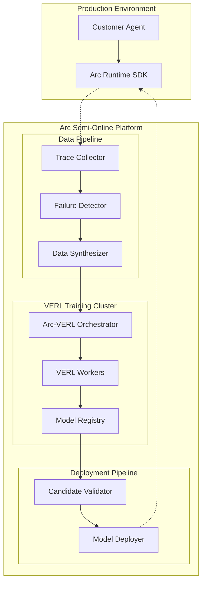

# Arc Semi-Online RL Architecture: Building on VERL

## Executive Summary

This document outlines how Arc can evolve from their current offline RL system to a semi-online RL platform using VERL as the foundational framework. By building a wrapper service similar to rLLM's approach, Arc can achieve continuous learning from production failures while maintaining the control and safety needed for enterprise deployment.

## Current State Analysis

### Arc's Existing Architecture (Offline Loop)
- **Runtime SDK**: Captures agent traces and streams to Arc Core
- **Failure Detection**: Classifies and clusters production failures  
- **Synthesis**: Generates evaluation sets and training datasets from failures
- **Training**: Offline RL training (currently manual/batched)
- **Validation**: Human-approved deployment with confidence scoring

### VERL's Capabilities
- **Semi-Online Support**: Configurable sync intervals (`s` parameter) for generator-trainer synchronization
- **Multi-Modal Ready**: Native Qwen2.5-VL support for vision-language tasks
- **Distributed Training**: Ray-based worker orchestration with HybridFlow efficiency
- **Flexible Backends**: vLLM, SGLang support for high-throughput inference
- **Production-Ready**: Memory optimization, FSDP, gradient checkpointing

## Semi-Online RL Strategy

### Key Research Insights from Meta's Paper

Based on "Bridging Offline and Online RL for LLMs", the optimal approach for Arc is:

1. **Semi-Online DPO with s=10-100**: Achieves 95%+ of online performance with significantly better efficiency
2. **Periodic Synchronization**: Update generation models every 10-100 training steps rather than every step
3. **Stability Benefits**: Less entropy collapse and more stable training than fully online
4. **Cost Efficiency**: Allows parallel data generation during training intervals

### Recommended Architecture: Arc-VERL Wrapper



## Implementation Roadmap

### Phase 1: Arc-VERL Integration (Months 1-2)

#### 1.1 Fork and Extend VERL
```bash
# Create Arc's VERL fork
git clone https://github.com/volcengine/verl.git arc-verl
cd arc-verl

# Key modifications needed:
# - Arc-specific reward models
# - Production trace integration
# - Multi-modal data pipelines
# - Enterprise security features
```

#### 1.2 Core Components to Build

**Arc Training Orchestrator** (`arc_verl/orchestrator/`)
```python
class ArcTrainingOrchestrator:
    """Orchestrates semi-online training from production failures"""
    
    def __init__(self, 
                 sync_interval: int = 50,  # Semi-online sync frequency
                 batch_size: int = 64,
                 max_parallel_jobs: int = 4):
        self.verl_trainer = VERLTrainer()
        self.failure_queue = FailureQueue()
        self.sync_interval = sync_interval
        
    async def run_continuous_training(self):
        """Main training loop with failure-driven data generation"""
        while True:
            # Collect production failures
            failures = await self.failure_queue.get_batch()
            
            # Synthesize training data
            training_data = self.synthesize_training_data(failures)
            
            # Run semi-online DPO training
            await self.train_model_iteration(training_data)
            
            # Validate and potentially deploy
            if self.should_deploy():
                await self.deploy_candidate()
```

**Multi-Modal Data Pipeline** (`arc_verl/data/`)
```python
class ArcMultiModalDataset(VERLDataset):
    """Extends VERL dataset for Arc's multi-modal traces"""
    
    def __init__(self, trace_data: List[AgentTrace]):
        self.traces = trace_data
        
    def process_trace(self, trace: AgentTrace) -> Dict:
        """Convert Arc trace to VERL training format"""
        return {
            'prompt': trace.get_multimodal_prompt(),  # Text + images
            'response': trace.response,
            'reward': self.compute_reward(trace),
            'metadata': trace.context
        }
        
    def compute_reward(self, trace: AgentTrace) -> float:
        """Arc-specific reward computation"""
        # Combine multiple signals:
        # - Task completion (binary)
        # - Code execution success
        # - Schema validation
        # - User feedback
        pass
```

**Production Integration Bridge** (`arc_verl/runtime_bridge/`)
```python
class RuntimeBridge:
    """Bridges Arc Runtime with VERL training"""
    
    async def stream_production_data(self):
        """Stream real-time data from Arc Runtime to training pipeline"""
        async for trace in self.runtime_client.stream_traces():
            if self.failure_detector.is_failure(trace):
                await self.training_queue.put(trace)
                
    async def deploy_model_update(self, model_path: str):
        """Deploy trained model back to Arc Runtime"""
        # Update model registry
        # Trigger gradual rollout
        # Monitor performance metrics
        pass
```

#### 1.3 Configuration System

**Semi-Online Training Config** (`configs/arc_semi_online.yaml`)
```yaml
# Arc Semi-Online RL Configuration
training:
  algorithm: "semi_online_dpo"
  sync_interval: 50  # Update generator every 50 steps
  batch_size: 64
  learning_rate: 1e-6
  max_steps: 10000

model:
  base_model: "Qwen/Qwen2.5-VL-3B-Instruct"
  use_lora: true
  lora_rank: 16
  
data:
  max_sequence_length: 2048
  vision_enabled: true
  failure_sampling_ratio: 0.8  # Focus on failures

deployment:
  validation_threshold: 0.85
  canary_percentage: 0.1
  auto_rollback: true
```

### Phase 2: Multi-Modal Extension (Months 2-3)

#### 2.1 Extend Arc Runtime for Vision

**Enhanced Runtime SDK** (`arc_runtime/multimodal/`)
```python
class ArcMultiModalRuntime(ArcRuntime):
    """Extended runtime with vision-language support"""
    
    def intercept_multimodal_call(self, 
                                  text: str, 
                                  images: List[Image],
                                  **kwargs) -> Dict:
        """Intercept and potentially fix VL model calls"""
        
        # Check for known multimodal failure patterns
        if self.pattern_matcher.matches_failure_pattern(text, images):
            return self.apply_multimodal_fix(text, images, **kwargs)
            
        # Log for training
        trace = self.create_multimodal_trace(text, images, **kwargs)
        self.stream_trace(trace)
        
        return self.forward_call(text, images, **kwargs)
```

#### 2.2 Vision-Specific Reward Models

**Arc Vision Reward System** (`arc_verl/rewards/vision/`)
```python
class ArcVisionReward:
    """Multi-modal reward computation for Arc tasks"""
    
    def __init__(self):
        self.task_classifiers = {
            'ui_automation': UITaskClassifier(),
            'document_analysis': DocumentAnalysisReward(),
            'code_generation': CodeExecutionReward()
        }
    
    def compute_reward(self, 
                      prompt: str, 
                      images: List[Image], 
                      response: str,
                      task_type: str) -> float:
        """Compute task-specific reward for vision-language interactions"""
        
        classifier = self.task_classifiers[task_type]
        return classifier.evaluate(prompt, images, response)
```

### Phase 3: Semi-Online Production Deployment (Months 3-4)

#### 3.1 Continuous Learning Pipeline

**Production Learning Loop** (`arc_verl/production/`)
```python
class SemiOnlineLearningLoop:
    """Manages continuous learning from production data"""
    
    def __init__(self, sync_interval: int = 50):
        self.sync_interval = sync_interval
        self.training_buffer = TrainingBuffer(max_size=10000)
        self.model_versions = ModelVersionManager()
        
    async def run_learning_loop(self):
        """Main production learning loop"""
        step = 0
        
        while True:
            # Collect production failures
            failures = await self.collect_recent_failures()
            self.training_buffer.add(failures)
            
            # Train for sync_interval steps
            if step % self.sync_interval == 0:
                await self.sync_models()
                
            if self.training_buffer.ready():
                await self.run_training_step()
                step += 1
                
            # Deploy if validation passes
            if step % (self.sync_interval * 4) == 0:
                await self.validate_and_deploy()
```

#### 3.2 Safety and Validation

**Enterprise Safety Wrapper** (`arc_verl/safety/`)
```python
class EnterpriseSafetyValidator:
    """Ensures models meet enterprise safety requirements"""
    
    def validate_candidate_model(self, model_path: str) -> ValidationResult:
        """Comprehensive model validation before deployment"""
        results = ValidationResult()
        
        # Functional testing
        results.functional_score = self.run_functional_tests(model_path)
        
        # Security scanning
        results.security_score = self.run_security_tests(model_path)
        
        # Bias and fairness testing
        results.fairness_score = self.run_fairness_tests(model_path)
        
        # Performance regression testing
        results.performance_score = self.run_performance_tests(model_path)
        
        return results
```

### Phase 4: Scale and Optimize (Months 4-6)

#### 4.1 Multi-Tenant Training

**Customer-Specific Training** (`arc_verl/multi_tenant/`)
```python
class MultiTenantTrainingManager:
    """Manages training for multiple customer environments"""
    
    def __init__(self):
        self.customer_trainers = {}
        self.shared_base_models = ModelRegistry()
        
    async def train_customer_model(self, 
                                   customer_id: str,
                                   failure_data: List[AgentTrace]):
        """Train customer-specific model while leveraging shared learnings"""
        
        # Get customer's base model
        base_model = self.get_customer_base_model(customer_id)
        
        # Apply customer-specific fine-tuning
        customer_model = await self.fine_tune_for_customer(
            base_model, failure_data, customer_id
        )
        
        # Update customer's model registry
        await self.deploy_customer_model(customer_id, customer_model)
```

#### 4.2 Advanced Analytics and Insights

**Learning Analytics Dashboard** (`arc_verl/analytics/`)
```python
class LearningAnalytics:
    """Analytics for semi-online learning performance"""
    
    def generate_learning_report(self, customer_id: str) -> LearningReport:
        """Generate insights on learning progress"""
        return LearningReport(
            failure_patterns_discovered=self.count_new_patterns(customer_id),
            fix_success_rate=self.compute_fix_success_rate(customer_id),
            model_improvement_metrics=self.get_improvement_metrics(customer_id),
            cost_savings=self.estimate_cost_savings(customer_id),
            recommendations=self.generate_recommendations(customer_id)
        )
```

## Technical Implementation Details

### Semi-Online Training Configuration

Based on the Meta research, optimal configuration for Arc:

```python
SEMI_ONLINE_CONFIG = {
    'algorithm': 'semi_online_dpo',
    'sync_interval': 50,  # Sweet spot for stability vs performance
    'beta': 0.1,  # DPO temperature
    'learning_rate': 1e-6,
    'adam_epsilon': 1e-4,  # Higher epsilon for stability
    'gradient_clip': 1.0,
    'ref_model_sync': True,  # Sync reference model
    'max_sequence_length': 2048,
    'batch_size': 64,
    'use_entropy_regularization': True,
    'entropy_coefficient': 0.0002
}
```

### Multi-Modal Data Handling

```python
class MultiModalTrainingData:
    """Handles vision-language training data for Arc"""
    
    def __init__(self):
        self.vision_processor = Qwen2VLProcessor()
        self.text_tokenizer = Qwen2Tokenizer()
        
    def process_failure_trace(self, trace: AgentTrace) -> TrainingExample:
        """Convert production failure to training example"""
        
        # Extract multimodal inputs
        text_inputs = trace.get_text_components()
        image_inputs = trace.get_image_components()
        
        # Process through vision-language processor
        processed_inputs = self.vision_processor(
            text=text_inputs,
            images=image_inputs,
            return_tensors="pt"
        )
        
        # Generate training pairs
        return TrainingExample(
            chosen_response=trace.correct_response,
            rejected_response=trace.failed_response,
            inputs=processed_inputs,
            reward_signal=self.compute_reward(trace)
        )
```

### Production Integration Architecture

```python
class ProductionIntegrationLayer:
    """Seamless integration with existing production systems"""
    
    def __init__(self):
        self.runtime_clients = {}  # Customer runtime connections
        self.training_orchestrator = ArcTrainingOrchestrator()
        self.deployment_manager = ModelDeploymentManager()
        
    async def handle_real_time_failure(self, 
                                       customer_id: str,
                                       failure_trace: AgentTrace):
        """Handle failures as they occur in production"""
        
        # Immediate pattern matching for known fixes
        if quick_fix := self.pattern_matcher.get_immediate_fix(failure_trace):
            await self.deploy_immediate_fix(customer_id, quick_fix)
            
        # Queue for learning if it's a new pattern
        else:
            await self.queue_for_learning(customer_id, failure_trace)
            
        # Update customer-specific failure taxonomy
        await self.update_failure_taxonomy(customer_id, failure_trace)
```

## Competitive Advantages

### Technical Moats

1. **Production-First Learning**: Learn from real failures, not synthetic data
2. **Multi-Modal Expertise**: Native vision-language failure remediation
3. **Enterprise-Grade Safety**: Comprehensive validation before deployment
4. **Customer-Specific Models**: Tailored solutions for each organization's failure patterns

### Business Model Implications

1. **Network Effects**: Each customer's failures improve the system for others
2. **Data Compound Advantage**: Proprietary "Failure-to-Fix" knowledge graph
3. **Continuous Value Creation**: Models improve automatically from production usage
4. **Reduced Customer Churn**: System becomes more valuable over time

## Implementation Timeline

| Phase | Duration | Key Deliverables | Success Metrics |
|-------|----------|------------------|-----------------|
| Phase 1 | 2 months | Arc-VERL integration, basic semi-online training | Training loop functional, 50% failure reduction |
| Phase 2 | 1 month | Multi-modal extensions, vision-language support | Support for UI automation and document analysis |
| Phase 3 | 1 month | Production deployment, safety validation | First customer in production, 90% uptime |
| Phase 4 | 2 months | Multi-tenant scaling, advanced analytics | 5+ customers, measurable ROI per customer |

## Risk Mitigation

### Technical Risks
- **Training Instability**: Use proven semi-online configurations from Meta research
- **Model Regression**: Comprehensive validation pipeline with automatic rollback
- **Latency Issues**: Efficient inference with vLLM/SGLang backends

### Business Risks
- **Customer Trust**: Gradual rollout with extensive validation and human oversight
- **Competitive Response**: Build defensible data moats and deep customer integration
- **Scaling Challenges**: Design for multi-tenancy from day one

## Conclusion

By building on VERL's proven semi-online RL infrastructure, Arc can evolve from a reactive debugging tool to a proactive, continuously learning system. The combination of production-driven learning, multi-modal capabilities, and enterprise-grade safety creates a compelling competitive moat in the AI reliability space.

The semi-online approach provides the optimal balance of learning efficiency and operational stability needed for enterprise deployment, while the multi-modal extensions address the growing demand for vision-language agent reliability.

This architecture positions Arc to capture the emerging market for autonomous AI operations while building sustainable competitive advantages through proprietary failure-to-fix knowledge graphs and customer-specific learning systems.